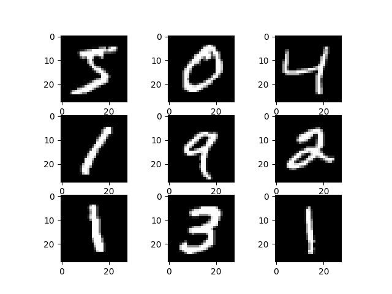

# CNN-model-for-written-numeric-MNIST-dataset

This project implements a Convolutional Neural Network (CNN) for handwritten digit recognition using the MNIST dataset in Python. The model is built with TensorFlow/Keras and includes:

- Data loading and preprocessing
- Model architecture with Conv2D, MaxPooling2D, Dense layers
- Training with k-fold cross-validation
- Visualization of training accuracy and loss
- Performance summary with box plots

## Results

Below are sample results from the model training and evaluation:

### Accuracy Graph

### Accuracy Box Graph

### Example Figure

## How to Run

1. Install required packages: `tensorflow`, `numpy`, `matplotlib`, `scikit-learn`
2. Run `data_cnn.py` to train and evaluate the model.

## License

See `LICENSE` for details.
